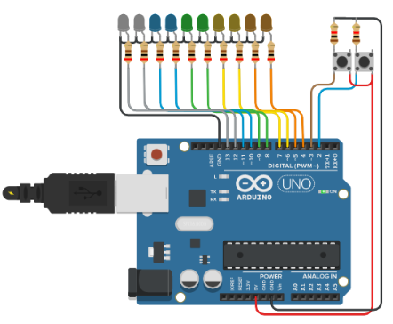

<table>
    <tr>
        <td align='center'>
            
        </td>
    </tr>
    <tr>
      <td align='center'>
            
        </td>
    </tr>
    <tr>
        <td align="center">
            
        </td>
    </tr>
</table></br>

</br>


<p align="center">
    
</p>

<p align="center">
    <a href="https://github.com/CaidevOficial">
        
    </a>
</p>
<br><br><br>

---


# Binary Chronometer Arduino! 
## [Link to circuit V1](https://www.tinkercad.com/things/3Who9f79MMb)
## [Link to circuit V2](https://www.tinkercad.com/things/0aOrYta9sFH)

<table align='center'>
  <th><center>Circuit Design</center></th>
  <tr align='center'>
    <td>
        
    </td>
  </tr>
</table></br>


<details>
  <summary>:zap: GitHub Stats</summary>
    <br><br>
</details>

<details>
    <summary>:zap: Most Used Languages</summary>
    <br>
</details>

---

```C++
void showNewSkill() {
  Serial.println("Learning Arduino");
  Serial.println("the best i can!");
}
```
---

## Technologies used. 📌
|<a href="https://docs.microsoft.com/es-es/dotnet/csharp/">|<h3>Arduino</h3>|
|--------|----------|

---

## License 📄
This project is under license \[MIT License\] - read the file [LICENSE.md](LICENSE) for details.

---

## Where to find me: 🌎

<table align='center'>
  <theader>
    <tr align='center'>
      <td>
        
      </td>
    </tr>
    <th><center>🤴 Facu Falcone - Data Engineer</center></th>
    </theader>
    <tbody>
    <tr align='center'>
      <td>
      <a href="https://github.com/caidevOficial/"></a>
      </td>
    </tr>
    <tr align='center'>
      <td>
        <a href="https://www.linkedin.com/in/facundo-falcone/"></a>
      </td>
    </tr>
    <tr align='center'>
      <td>
        <a href="https://cafecito.app/caidevoficial/"></a>
      </td>
    </tr>
    <tr align='center'>
      <td>
        <a href='https://ko-fi.com/P5P74JBOH' target='_blank'></a>
      </td>
    </tr>
  </tbody>
</table>

---
